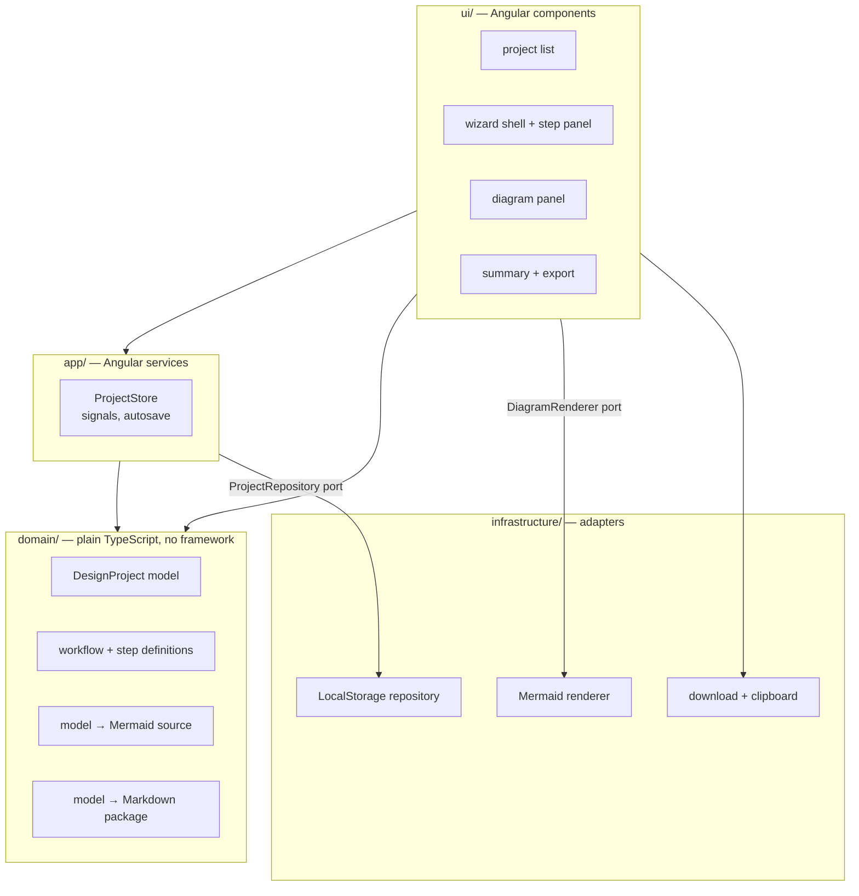

# MVP architecture and implementation plan

- **Status:** Proposed — awaiting review. No application code is written until
  this is accepted.
- **Date:** 2026-10-08
- **Source:** [product-spec.md](product-spec.md), sections 12, 14 and 16 in
  particular.

Once accepted, the decisions marked **(ADR)** below are recorded under
[decisions/](decisions/README.md) and each slice in the plan becomes a GitHub
issue.

## 1. What the MVP is

A single-page Angular app, running entirely in the browser, that walks a
developer through the **New Project** or **Feature / Change** workflow one step
at a time, keeps the design locally, draws Mermaid diagrams from what the user
has entered, and exports a Markdown design package.

In MVP scope (spec §14): both modes, wizard navigation, step explanations,
persistent project state, design notes, Mermaid diagrams, design summary,
Markdown export, local persistence.

Out of MVP scope, with a seam left for each: AI provider calls, the heuristic
critique engine (§8), design-it-twice comparisons and auto-generated ADRs
(§7, §9), downstream-impact tracking, the history timeline, JSON/Mermaid
export, codebase import.

## 2. The key design decision: the project is a structured model, everything else is a projection

The coach can only draw a module diagram, flag a dependency cycle or write
`module-design.md` if it knows what the modules *are*. Free-text answers alone
cannot feed any of that. So:

- Each wizard step declares its **questions with typed answer kinds**: short
  text, long text, a list of strings, a choice, or an **entity list** (rows
  with fields, such as modules with a responsibility, hidden knowledge and
  dependencies).
- Answers that describe structure (actors, use cases, domain concepts,
  external systems, modules, dependencies) land in a **design model**:
  typed collections the rest of the app can reason about.
- **Diagrams, the summary, the Markdown package, and later the critique and
  the AI prompts are pure functions of that model.** None of them stores
  state of its own, so none of them can drift out of step with it.

This is what keeps the product deep: one model with a small API, and many
read-only views over it. **(ADR)**

## 3. Architecture

Four layers, dependencies pointing inward only. The domain knows nothing about
Angular, the browser or Mermaid's renderer.



| Module | Owns (the knowledge it hides) | Interface, roughly |
| --- | --- | --- |
| `domain/project` | The shape of a design project, how answers and entities are stored, invariants (ids, ordering, references between entities). | `createProject(mode)`, `answer(project, stepId, questionId, value)`, `addNote(...)` — immutable updates returning a new project. |
| `domain/workflows` | The two workflows and every step's coaching content: why it matters, questions, example, challenge prompts, which diagram it shows. **Content is data, not component markup.** | `workflowFor(mode)` → ordered steps. |
| `domain/diagrams` | Mermaid syntax and how each diagram kind is derived from the model. | `diagramFor(project, kind)` → Mermaid text. |
| `domain/package` | The design package's file list and Markdown templates. | `buildPackage(project)` → `{ path, markdown }[]`. |
| `app/ProjectStore` | Which project is open, the current step, autosave timing, schema migration on load. The only writer of project state. | `project` / `currentStep` signals, `open(id)`, `answer(...)`, `goTo(stepId)`, `addNote(...)`. |
| `infrastructure/storage` | `localStorage` keys, serialization, the stored schema version. | `ProjectRepository`: `list()`, `load(id)`, `save(project)`, `remove(id)`. |
| `infrastructure/mermaid` | Mermaid's API, lazy-loading it, theming it dark, click callbacks. | `DiagramRenderer.render(source, host)`. |

Why these seams, and only these:

- **ProjectRepository** is a port because storage is the one dependency the
  spec already says will change (local now, sync later). IndexedDB or a backend
  then means one new adapter.
- **DiagramRenderer** is a port because Mermaid is a large, foreign,
  browser-only library; keeping it out of the domain means diagram generation
  is tested as plain strings, fast, without a DOM.
- **No AI port yet.** An interface with no second implementation and no caller
  hides nothing (rule 9). It arrives with the first slice that needs it — the
  advisor slice after the MVP — with a local heuristic implementation first
  and an LLM implementation behind the same interface. **(ADR when built)**

## 4. Technology

| Choice | Recommendation | Why |
| --- | --- | --- |
| Framework | Current Angular, standalone components, **signals**, zoneless change detection, strict TypeScript | Spec §12; signals + OnPush match the installed Angular rules. |
| Styling | SCSS with **design tokens as CSS custom properties** and a small set of own components; **no Bootstrap** | Spec §13 asks for a distinctive dark developer-tool look and warns against a generic SaaS feel, which is Bootstrap's default. Our needs (rail, panels, forms, tabs, drawer) are small. **(ADR — open question 1)** |
| Diagrams | `mermaid` npm package, lazy-loaded | Versioned and offline-capable, unlike a CDN script; lazy-loading keeps the first paint light. **(ADR)** |
| Persistence | `localStorage`, one key per project plus an index, with a schema version | A design project is tens of KB; localStorage is synchronous and simple. IndexedDB is a later adapter if size demands it. **(ADR)** |
| Unit tests | Vitest (the Angular CLI default) | Fast; the domain layer needs no browser. |
| Lint | angular-eslint | Standard for Angular. |
| Commit hooks | husky + commitlint, as suggested by the installed TypeScript pack | Enforces the commit format the playbook expects. |
| CI | GitHub Actions: `npm ci`, lint, test, build on every PR | Agents run in `merge` mode, so CI is the safety net. |
| Hosting | None in the MVP — runs locally with `ng serve` | Spec §12: no unnecessary infrastructure. A static host is a one-step addition later. |

New dependencies need your sign-off (rule 6): Angular itself, `mermaid`,
Vitest, angular-eslint, husky, commitlint.

## 5. Screens

```
+--------------------------------------------------------------------------+
| ◇ Design Coach   Project: Order Service  ▸ New Project      [Export ▾]    |
+------------+--------------------------------------+----------------------+
| JOURNEY    |  STEP 9 · MODULES                    |  VISUALIZE           |
| ✓ Problem  |                                      |                      |
| ✓ Users    |  THINK   Why modules? (expand)       |   [Mermaid module    |
| ✓ Goals    |  DECIDE  ┌──────────────────────┐    |    diagram, click a  |
|   ...      |          │ name │ hides │ deps  │    |    module for its    |
| ▶ Modules  |          └──────────────────────┘    |    details drawer]   |
|   Respons. |  CHALLENGE  "Does Pricing hide       |                      |
|   ...      |   anything, or only forward?"        |                      |
|            |  [Why am I asked?] [Show example]    |                      |
|            |  Notes ▾                [Continue →] |                      |
+------------+--------------------------------------+----------------------+
```

1. **Projects** — list, create (pick mode), open, delete.
2. **Wizard** — journey rail · step panel (THINK / DECIDE / CHALLENGE /
   CONTINUE, one major question at a time, explanations behind disclosure) ·
   VISUALIZE panel. Collapses to one column on narrow screens.
3. **Summary** — the whole design on one page, print-friendly, with export.

## 6. Implementation plan — vertical slices

Each slice is one issue and one pull request, shippable on its own, built
Red → Green → Refactor. Sizes are relative (XS–XL).

| # | Slice | Proves | Size |
| --- | --- | --- | --- |
| 0 | **Scaffold.** Angular app, strict TS, Vitest, ESLint, husky/commitlint, dark theme tokens, app shell, CI workflow. Fill in real commands. | The toolchain and checks work end to end. | S |
| 1 | **Walking skeleton.** Domain model + workflow schema + ProjectStore + LocalStorage repository. Create a New Project, answer the first three steps (Problem, Users, Goals), reload the page and resume. | The core model, persistence and wizard loop. Every later slice adds content or a projection to this. | M |
| 2 | **New Project workflow, complete.** All 19 steps as content: why, questions, example, challenge prompts; typed answers including entity lists; journey rail with progress and free navigation. | Progressive disclosure and the step content format scale to a full workflow. | L |
| 3 | **Live diagrams.** Mermaid renderer adapter; diagrams derived from the model: system context, use case, domain model, module, dependency, first vertical slice. | "Diagrams are projections" works; the domain layer stays DOM-free. | M |
| 4 | **Interactive module diagram.** Click a module → drawer with responsibilities, hidden knowledge, dependencies and related notes. | Spec §6 interactivity. | S |
| 5 | **Feature / Change workflow.** The 14-step workflow as content, reusing everything from slices 1–4. | The workflow engine is general, not shaped around one mode. | M |
| 6 | **Design notes + summary page.** Per-step notes; a print-friendly summary of the whole design. | Spec §14 notes and summary. | S |
| 7 | **Markdown export.** The design package files from the model; download each, download all as one combined `.md`, copy to clipboard. | Spec §10 output, MVP subset. | M |

After slice 7 the MVP is complete: **validate the workflow with real use
before expanding** (spec §16). Candidate next slices, in rough order: design-it-
twice alternatives + ADR generation; a heuristic critique engine behind a
`DesignAdvisor` port (cycles, shallow modules, unowned knowledge, duplicated
ownership, missing non-goals); downstream-impact flags when an earlier answer
changes; history timeline; JSON and Mermaid export; zip export; an LLM-backed
advisor.

### How each slice is tested

- **Domain** (model updates, workflow definitions, diagram and Markdown
  generation): unit tests written first. Diagram tests assert on Mermaid text,
  not pixels.
- **ProjectStore + repository:** tests against an in-memory repository, plus a
  round-trip test through the real localStorage adapter.
- **Components:** a few behavioral tests per screen (answer → continue →
  rail updates); no snapshot tests.
- **Manual check** in the running app for each slice's acceptance criteria,
  reported in the PR as still needed or done.

## 7. Open questions for review

1. **Bootstrap or own component system?** Recommendation: own small system on
   CSS tokens, for the look spec §13 asks for. Bootstrap would be faster for
   forms but pulls toward the generic look the spec rules out.
2. **Dependencies.** Approve Angular, `mermaid`, Vitest, angular-eslint, husky
   and commitlint?
3. **Repository visibility.** Created **private**. Make it public?
4. **Order of slices 3 and 5.** Diagrams before the second workflow is the
   recommendation — it validates the "projections" decision earlier.
